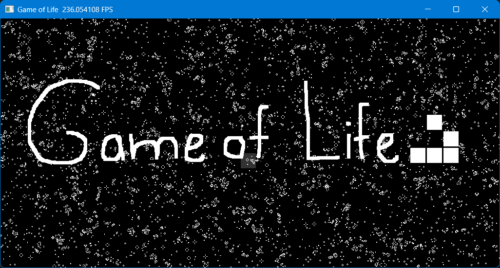

# Game of Life

[**Conway's Game of Life**](https://en.wikipedia.org/wiki/Conway%27s_Game_of_Life) written in **Python**, using [Taichi lang](https://www.taichi-lang.org).



## Features

### Capabilities

-   Standard [rules](https://en.wikipedia.org/wiki/Conway%27s_Game_of_Life#Rules)
-   [Finite field as todorial array](https://en.wikipedia.org/wiki/Conway%27s_Game_of_Life#Algorithms:~:text=In%20principle%2C%20the,M%C3%B6bius%20strip.)
-   Instant in-app restart

### Settings

-   Field size
-   Cells color
-   Start condition
-   Backend computing
-   Profiling

## Installation

### Prerequisites

As the project is written in **Python**, you must have [Python interpreter](https://www.python.org/downloads/) installed on machine to run code.<br>

> [!IMPORTANT]  
> Not all Python versions work with Taichi. Which specific do are listed on [official website](https://docs.taichi-lang.org/docs/hello_world#prerequisites). To avoid further conflicts [release 3.10.11](https://www.python.org/downloads/release/python-31011/) is recommended.

### Repository

To get a local copy of repository open terminal and execute `git clone` command:

```
git clone https://github.com/wivest/Game-of-Life.git
```

### Packages

Some external Python packages are required, including **Taichi**. To install them open cloned directory in terminal:

```
cd Game-of-Life
```

> [!TIP]  
> _Optional step. Recommended to avoid package versions conflicts._<br>
> To manage Python packages **virtual environment** can be created. More information can be found [here](https://docs.python.org/3/library/venv.html).

To collect missing packages execute `pip install` command:

```
pip install -r requirements.txt
```

### Run

Launch `main.py` file by executing `python` command:

```
python main.py
```

## Configuration

By editing parameters in [`source/parameters.py`](source/parameters.py) you can customize application behaviour. Here are listed available ones for user:

| Name         | Type    | Description                                                                                        |
| ------------ | ------- | -------------------------------------------------------------------------------------------------- |
| `COLS`       | `int`   | Number of field columns.<br>_Default: `1024`_                                                      |
| `ROWS`       | `int`   | Number of field rows.<br>_Default: `512`_                                                          |
| `ARCH`       | _other_ | Backend architecture used by Taichi.<br>_Suggested: `ti.gpu` and `ti.cpu`._<br>_Default: `ti.gpu`_ |
| `PROFILING`  | `bool`  | Enable profiling of Taichi kernel in form of terminal output.<br>_Default: `False`_                |
| `ALIVE`      | `Color` | Alive cell color in RGB format.<br>_Default: `Color(255, 255, 255)`_                               |
| `DEAD`       | `Color` | Dead cell color in RGB format.<br>_Default: `Color(0, 0, 0)`_                                      |
| `PERCENTAGE` | `float` | Percentage of alive cells when randomizing field.<br>_Default: `0.1`_                              |
